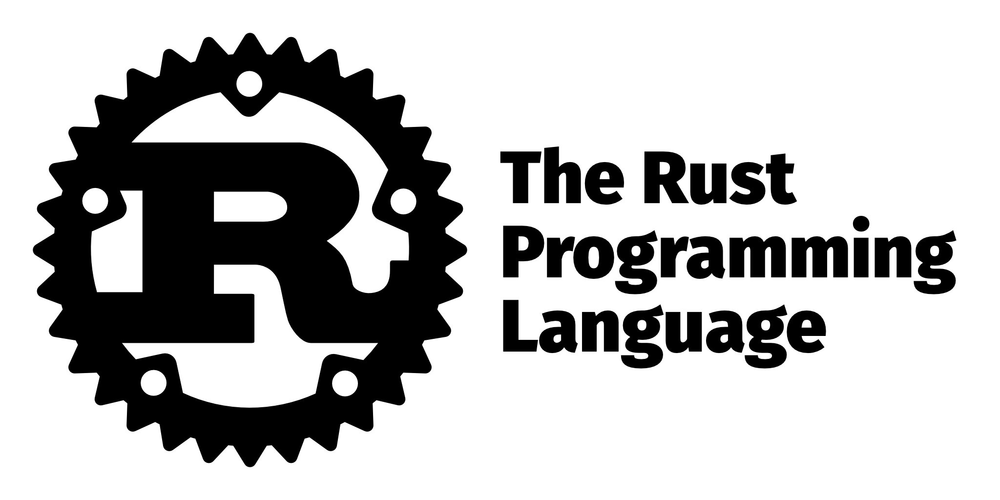

# Multithreaded Web Server

A simple multithreaded web server implemented in Rust.

This project was a practice one at the end of the official rust-lang book that servers the purpose of practicing various topics that were introduced.

The official book: https://doc.rust-lang.org/book/
## Main Features

- Utilizes Rust's standard library TCP listener and TCP stream for handling client connections.
- Implements multithreading to handle concurrent client requests efficiently.
- Uses mpsc channels for message passing between threads, ensuring safe and synchronized communication.
- Employs Arc (atomic reference counting) and Mutex for shared ownership and synchronization of resources among threads.

## Usage

1. Clone the repository: `git clone https://github.com/Wa3Wa3/Rust-web-server.git`
2. Navigate to the project directory: `cd Rust-web-server`
3. Build and run the web server: `cargo run`
4. Access the web server by visiting `127.0.0.1:7878` in your web browser.
5. You should see some useful debugging messages printed to the console of your program, as well as a simple HTML page rendered in your browser.
6. You can visit `127.0.0.1:7878/sleep` for a simulated loading page that takes **five seconds** to load, you can also make a lot of requests and the server should handle all those requests in parallel.
7. There is a simple not found HTML response for any requests that are not handled.
8. The server is manually limited to **20 requests** and then shuts down for the purpose of demonstration the shutting down debugging messages that are printed to the console. you can alter that in the main function of the project in `main.rs` easily.

